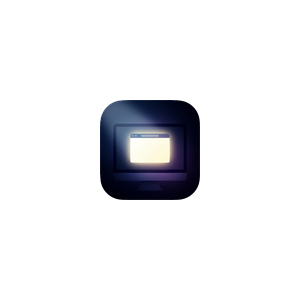

# Focus Dimmer

  

  <b>アクティブなウィンドウ以外を暗くし、作業への集中力を高める Windows 用ユーティリティアプリ</b> 
  <i>A modern Windows utility that dims non-active windows and displays to help you stay focused.</i>

---

## 🌟 主な機能 / Key Features

- 🎯 **スマートフォーカス減光**: 現在アクティブなウィンドウのみを明るく保ち、背景のウィンドウや他のディスプレイを暗転・減光。
- 🖥️ **マルチモニター対応 (PRO)**: 各ディスプレイごとに異なる不透明度や色を個別設定可能。
- 🚫 **除外設定 (Exclusions)**: タスクバー、デスクトップ、ピクチャーインピクチャー、特定のアプリなどを減光対象から除外。
- ⌨️ **ホットキー**: グローバルショートカットで素早く減光の ON/OFF を切り替え。
- 🎨 **カラーカスタマイズ (PRO)**: 黒だけでなく、好みの色でオーバーレイ表示。
- 🚀 **軽量・モダン UI**: WPF / WinUI Fluent Design に準拠したモダンで直感的なインターフェース。

---

## 📦 ダウンロード / Get it from Microsoft Store

公式バイナリは Microsoft Store から入手できます。

---

## 📄 ライセンス / License

本プロジェクトのソースコードは、学習・研究・個人利用を目的として公開されています（Source-Available）。

- **商用利用・ストアへの再配布禁止**: 著作権者の書面による事前の許可なく、本ソフトウェア（またはその改変版）のバイナリを Microsoft Store やその他マーケットプレイスへ公開・再配布・販売することは禁止されています。
- **商標・ロゴの保護**: アプリ名「Focus Dimmer」およびアイコン等のアセットは著作権者に帰属し、派生物での無断使用はできません。

詳細は [LICENSE](./LICENSE) をご確認ください。
