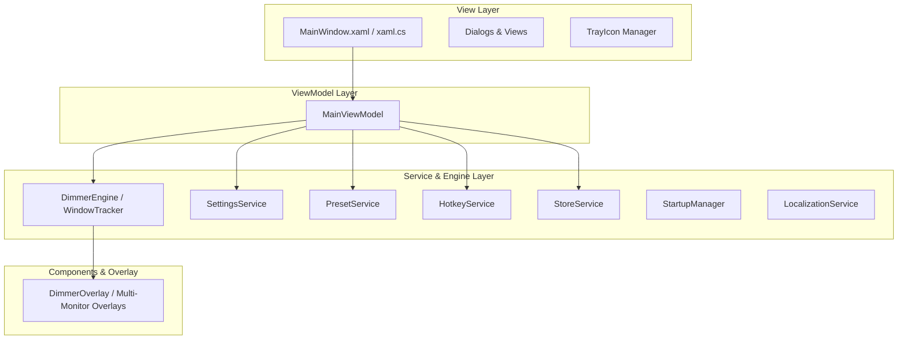

# FocusDimmer2 徹底コードレビュー & リファクタリング計画

FocusDimmer2 の全ソースコード（UI、データモデル、Win32 API連携、ストア課金、減光コア処理、プリセット制御）を徹底調査・レビューし、保守性・テスタビリティ・パフォーマンス・堅牢性を飛躍的に高めるリファクタリング計画を策定しました。

---

## 1. コードレビュー結果・現状の課題と技術的負債

### 🚨 課題 1: `MainWindow.xaml.cs` の巨大化（God Class / 1,697行）
- **現状**: `MainWindow.xaml.cs` 1ファイル内に、UI View、ViewModel（プロパティ・コマンド）、設定ファイルIO（JSON読み書き）、Win32 ホットキー管理、トレイアイコン管理、減光制御ループ（`MonitorTimer_Tick` / 240行）、プロセス自動連動ループ（`ActiveProcessCheckTimer_Tick`）、ストア通信などがすべて混在しています。
- **リスク**: 1つの機能の修正が他の無関係な処理に意図しない副作用を与えやすく、単体テストが不可能です。

### 🚨 課題 2: MVVM パターンの不完全さ
- **現状**: `DataContext = this;` となっており、Window が直接 ViewModel を兼ねています。
- **改善点**: 状態管理とビジネスロジックを `MainViewModel` に抽出し、View（XAML / コードビハインド）は純粋な UI プレゼンテーションのみを担当するようにします。

### 🚨 課題 3: 減光コアエンジン（DimmerEngine）の密結合
- **現状**: 100ms 間隔で実行される `MonitorTimer_Tick` 内で、Win32 API 呼び出し、ウィンドウ追跡、除外リストマッチング、アイドル時間計算、各モニターのオーバーレイ制御が直接実行されています。
- **改善点**: 減光制御を `DimmerEngine` / `WindowTrackerService` としてカプセル化し、UI スレッドや View から独立させます。

### 🚨 課題 4: プリセット・ルール制御の分散
- **現状**: プリセットの CRUD、モニター間同期（`SyncProfileToPreset`, `PropagateToLinkedMonitors`）、プロセス連動自動切り替えが `MainWindow.xaml.cs` に点在し、再帰制御フラグ（`_isApplyingPreset`）に依存しています。
- **改善点**: `PresetService` として独立させ、プリセットの適用・同期・自動切り替え判定を明確に定義します。

---

## 2. 提案するリファクタリング設計

---

## 3. 段階的リファクタリング実施計画

安全にリファクタリングを進めるため、以下の4フェーズに分けて段階的に実装・検証を行います。

### Phase 1: 共通サービス層の抽出（ロジックの分離）
1. **`SettingsService`**:
   - 設定読み込み（フォールバック付き）・デバウンス非同期保存・データ整合性チェックを担当。
2. **`HotkeyService`**:
   - Win32 `RegisterHotKey` / `UnregisterHotKey` と `HwndSource` メッセージフックをカプセル化。
3. **`PresetService`**:
   - プリセットの CRUD、モニター設定との双方向同期、アクティブプロセス検知に基づく自動プリセット切り替えロジックをカプセル化。

### Phase 2: 減光コアエンジン（DimmerEngine）の分離
1. **`DimmerEngine`**:
   - `MonitorTimer_Tick`（100ms ポーリング）内のウィンドウ追跡、除外判定、タスクバー・PiP 判定、アイドル時間判定を独立サービス化。
2. **`DimmerOverlay` の整理**:
   - 幾何演算（穴あき計算）とアニメーション制御の責任を明確化。

### Phase 3: MVVM アーキテクチャの導入と MainWindow のスリム化
1. **`MainViewModel`**:
   - 全プロパティ（`IsPro`, `MonitorProfiles`, `GlobalPresets`, `Strings`, etc.）、コマンド、状態通知を統括。
2. **`MainWindow.xaml.cs`**:
   - 1,697行から **約200行以下** の純粋な View コード（イベントルーティング・ウィンドウハンドラのみ）へとスリム化。

### Phase 4: ビルド・リグレッション検証
1. **全ビルド構成での検証**:
   - `Lite`（フリー版固定）
   - `Debug`
   - `Release`
   - `Pro`（PRO版固定）
2. **動作検証**:
   - マルチモニター減光、除外設定、ホットキー、プリセット切り替え、プロセス連動、ストア購入フローが正常動作することを確認。

---

## 4. 検証計画

### 自動ビルドテスト
- `dotnet build FocusDimmer2/FocusDimmer.csproj -c Lite`
- `dotnet build FocusDimmer2/FocusDimmer.csproj -c Debug`
- `dotnet build FocusDimmer2/FocusDimmer.csproj -c Release`
- `dotnet build FocusDimmer2/FocusDimmer.csproj -p:DefineConstants="PRO" -c Release`

### 手動機能検証
- 各種設定の保存と再起動後の復元
- ウィンドウアクティブ切り替えに伴う減光アニメーション
- ホットキーでの減光トグル・明暗調整
- プリセットの作成・切り替え・プロセス連動自動切り替え
